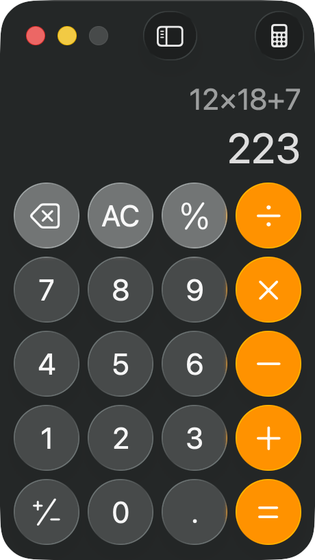

# Replay — Calculator — Layer 2a deterministic (zero vision)

## 1. Task

- **Goal:** Compute 12 multiplied by 18, then add 7, using the keys.
- **App:** Calculator
- **Session:** `s10-calc-1782491632`

## 2. Cascade path

- **Layer used:** `deterministic`
- **Vision calls:** 0  |  **LLM calls:** 1

## 3. Why this layer

Goal maps to a fixed, known input sequence; an LLM plans it ONCE, then the loop dispatches with no LLM in it. Zero vision.

## 4. Actions (scan → act → verify)

| turn | action(s) | outcome |
|---|---|---|
| 1 | press_key(1) | ok |
| 2 | press_key(2) | ok |
| 3 | press_key(8) | ok |
| 4 | press_key(1) | ok |
| 5 | press_key(8) | ok |
| 6 | press_key(plus) | ok |
| 7 | press_key(7) | ok |
| 8 | press_key(=) | ok |
| 9 | hotkey(cmd+c) | copied result to clipboard |

## 5. Screenshot (last recorded turn)

## 6. Verification

- **Success:** True
- **Result / final state:** 223

## 7. Cost (V9 ledger, agent=computer)

| provider | calls | in_tok | out_tok | ok | est $ |
|---|---|---|---|---|---|
| cerebras | 1 | 378 | 157 | 1/1 | $0.00027 |

## 8. Trajectory evidence

- **Turns recorded:** 11
- **Trajectory dir:** `trajectories/calc/` (per-turn `action.json` + `screenshot.png` + `app_state.json`)
- Replay with: `cua-driver call replay_trajectory '{"trajectory_dir":"/Users/tanmsh-blrm24/Downloads/assignment6/S10SharedCode/trajectories/calc"}'`
