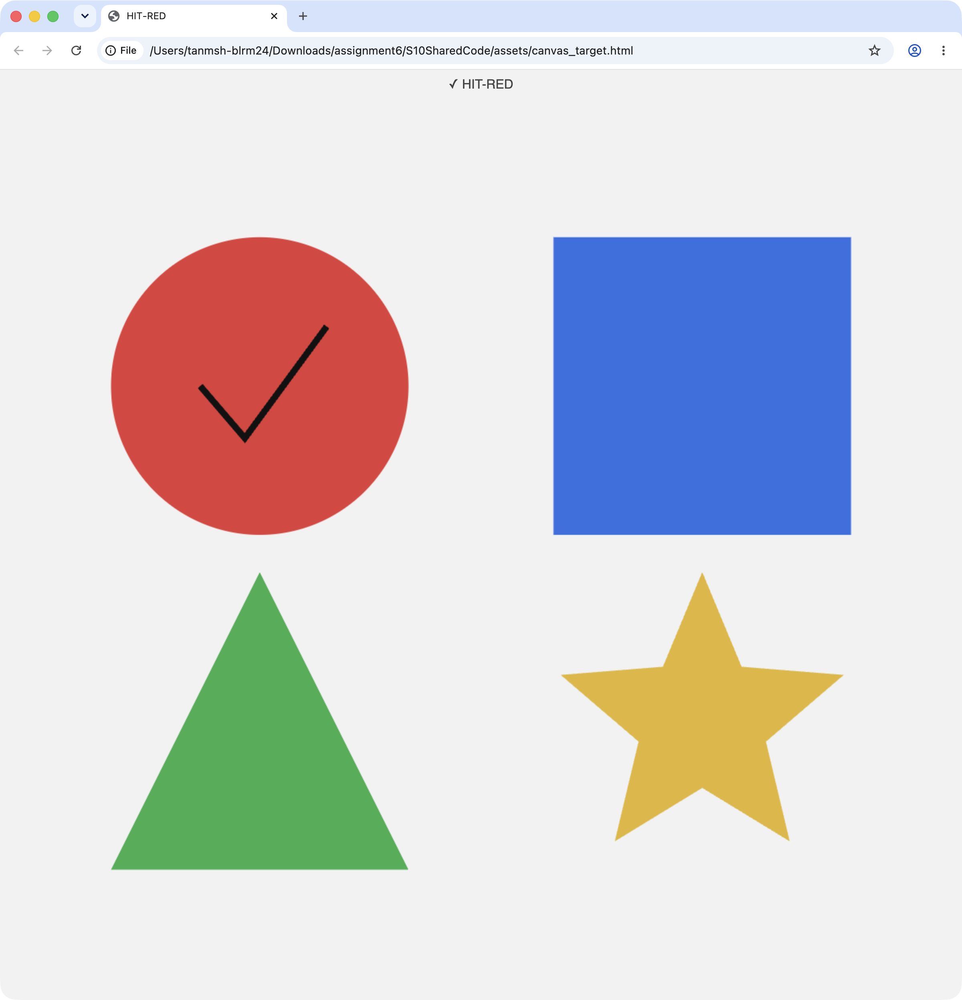

# Replay — Canvas target — Layer 3 vision / set-of-marks

## 1. Task

- **Goal:** Click the center of the red circle.
- **App:** Google Chrome
- **Session:** `s10-canvas-1782488803`

## 2. Cascade path

- **Layer used:** `vision`
- **Vision calls:** 1  |  **LLM calls:** 1

## 3. Why this layer

The target is canvas/pixels with no actionable AX node, so the cascade escalates to a screenshot + set-of-marks + vision LLM, clicking by coordinate.

## 4. Actions (scan → act → verify)

| turn | action(s) | outcome |
|---|---|---|
| 1 | click(7) | clicked mark 7 @(452,588); The red circle is the target. The yellow bo |

## 5. Screenshot (last recorded turn)

## 6. Verification

- **Success:** True
- **Result / final state:** post-condition met after clicking mark 7 (set-of-marks on 1509x1568 screenshot)

## 7. Cost (V9 ledger, agent=computer)

| provider | calls | in_tok | out_tok | ok | est $ |
|---|---|---|---|---|---|
| groq | 1 | 2687 | 37 | 1/1 | $0.00043 |

## 8. Trajectory evidence

- **Turns recorded:** 2
- **Trajectory dir:** `trajectories/canvas/` (per-turn `action.json` + `screenshot.png` + `app_state.json`)
- Replay with: `cua-driver call replay_trajectory '{"trajectory_dir":"/Users/tanmsh-blrm24/Downloads/assignment6/S10SharedCode/trajectories/canvas"}'`
