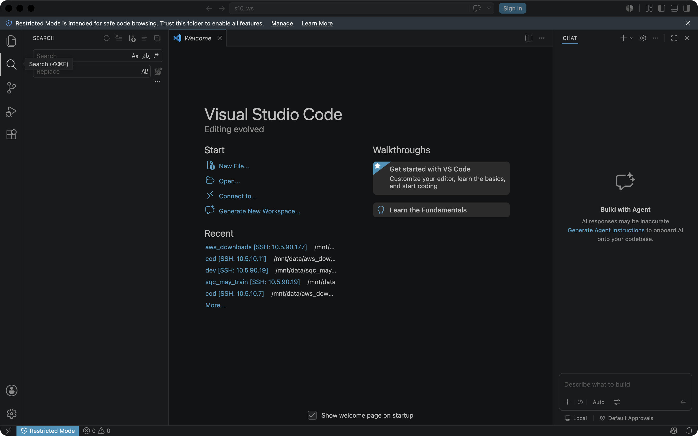

# Replay — VS Code — Electron page path (zero vision)

## 1. Task

- **Goal:** In an isolated VS Code window, confirm the workbench loaded, open the Search view from the activity bar, and report which view is active.
- **App:** Visual Studio Code
- **Session:** `s10-vscode-1782491659`

## 2. Cascade path

- **Layer used:** `deterministic`
- **Vision calls:** 0  |  **LLM calls:** 0

## 3. Why this layer

Goal maps to a fixed, known input sequence; an LLM plans it ONCE, then the loop dispatches with no LLM in it. Zero vision.

## 4. Actions (scan → act → verify)

| turn | action(s) | outcome |
|---|---|---|
| 1 | query_dom() | [{"tag": "DIV", "text": "s10_ws\nSign In\nOpen in Agents\nRestricted M |
| 2 | execute_javascript() | Welcome — s10_ws |
| 3 | click(.activitybar .action-item a.action-label[aria-label^='Search']) | clicked  @(24,133) dpr=1 |
| 4 | execute_javascript() | Search (⇧⌘F) |

## 5. Screenshot (last recorded turn)

## 6. Verification

- **Success:** True
- **Result / final state:** Search (⇧⌘F)

## 7. Cost (V9 ledger, agent=computer)

_no LLM calls (pure deterministic / CDP path)_

## 8. Trajectory evidence

- **Turns recorded:** 3
- **Trajectory dir:** `trajectories/vscode/` (per-turn `action.json` + `screenshot.png` + `app_state.json`)
- Replay with: `cua-driver call replay_trajectory '{"trajectory_dir":"/Users/tanmsh-blrm24/Downloads/assignment6/S10SharedCode/trajectories/vscode"}'`
